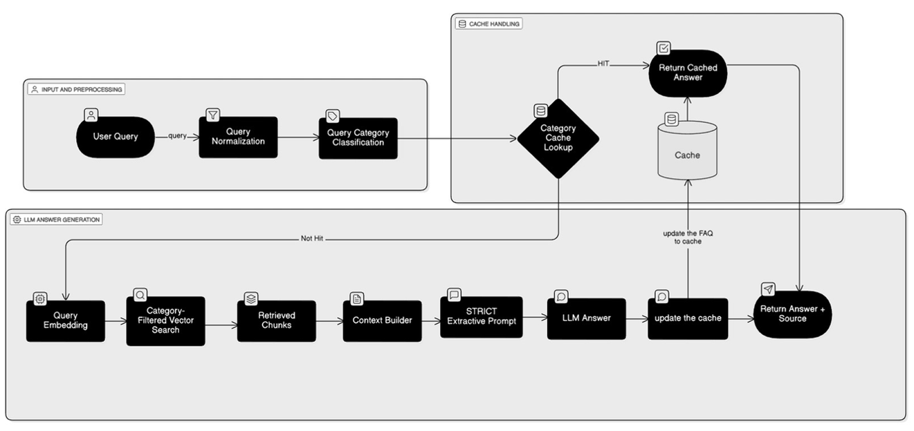

# 📚 Extractive Retrieval-Augmented Generation (RAG)

<p align="center">
  
</p>

<p align="center">
An intelligent <b>Extractive Retrieval-Augmented Generation (RAG)</b> system built using <b>LLaMA 3.1</b>, <b>all-mpnet-base-v2</b>, and <b>ChromaDB</b> to provide fast, accurate, and context-aware responses from document collections.
</p>

<p align="center">
  
  
  
  
  
</p>

---

# 📖 Overview

This project implements an **Extractive Retrieval-Augmented Generation (RAG)** pipeline that combines semantic search with Large Language Models to answer user queries using information retrieved from documents.

Instead of relying solely on the LLM's internal knowledge, the system retrieves the most relevant document chunks from a **ChromaDB vector database**, builds contextual information, and generates responses grounded in the retrieved content.

To improve performance, the system also includes:

- Vector-based query classification
- Intelligent caching
- Dynamic document chunking
- Semantic vector search
- Interactive Streamlit interface

---

# ✨ Features

- 📄 Extractive Retrieval-Augmented Generation (RAG)
- 🤖 LLaMA 3.1 for answer generation
- 🧠 Semantic embeddings using all-mpnet-base-v2
- 📦 ChromaDB vector database
- 🎯 Query category classification
- 🔍 Category-filtered vector retrieval
- 📑 Dynamic document chunking
- ⚡ Intelligent cache handling
- 🚀 Faster responses through caching
- 🌐 Interactive Streamlit web application
- 📚 Context-aware question answering
- 📖 Source document retrieval

---

# 🏗️ System Architecture

The system processes user queries through preprocessing, semantic classification, intelligent cache lookup, vector retrieval, and LLM-based answer generation.

<p align="center">
  
</p>

---

# 🔄 Workflow

### Step 1 — User Query

The user submits a question through the Streamlit interface.

↓

### Step 2 — Query Normalization

The query is cleaned and normalized to improve retrieval accuracy.

↓

### Step 3 — Query Category Classification

The query is classified into an appropriate semantic category.

↓

### Step 4 — Cache Lookup

The system checks whether an answer already exists in the cache.

- Cache Hit → Return cached response instantly.
- Cache Miss → Continue to retrieval pipeline.

↓

### Step 5 — Query Embedding

The normalized query is converted into semantic vectors using **all-mpnet-base-v2**.

↓

### Step 6 — Category Filtered Search

The embedding is searched against ChromaDB to retrieve the most relevant document chunks.

↓

### Step 7 — Context Builder

Retrieved chunks are combined into contextual information.

↓

### Step 8 — Strict Extractive Prompt

A constrained prompt is created to ensure the LLM answers only from retrieved content.

↓

### Step 9 — LLaMA 3.1

The LLM generates the final answer.

↓

### Step 10 — Cache Update

The generated FAQ and response are stored for future queries.

↓

### Step 11 — Return Answer + Source

The final answer along with its source documents is returned to the user.

---

# 🛠️ Technologies Used

| Technology | Purpose |
|------------|---------|
| Python | Backend Development |
| LLaMA 3.1 | Large Language Model |
| all-mpnet-base-v2 | Sentence Embeddings |
| ChromaDB | Vector Database |
| Streamlit | Web Application |
| LangChain | RAG Pipeline |
| NumPy | Numerical Operations |
| Pandas | Data Processing |

---

# 📂 Project Structure

```
Extractive-RAG/
│
├── assets/
│   └── system_architecture.png
│
├── data/
│   └── documents/
│
├── chroma_db/
│
├── app.py
├── rag.py
├── embedding.py
├── utils.py
├── requirements.txt
├── README.md
│
└── cache/
```

---

# ⚙️ Installation

## Clone the Repository

```bash
git clone https://github.com/your-username/extractive-rag.git
```

```bash
cd extractive-rag
```

---

## Create Virtual Environment (Optional)

### Windows

```bash
python -m venv venv
venv\Scripts\activate
```

### Linux / macOS

```bash
python3 -m venv venv
source venv/bin/activate
```

---

## Install Dependencies

```bash
pip install -r requirements.txt
```

---

# ▶️ Run the Application

Launch the Streamlit application:

```bash
streamlit run app.py
```

Open your browser:

```
http://localhost:8501
```

---

# 🚀 Pipeline

```
User Query
      │
      ▼
Query Normalization
      │
      ▼
Query Classification
      │
      ▼
Cache Lookup
   │        │
Hit       Miss
 │          │
 ▼          ▼
Return   Query Embedding
           │
           ▼
     Vector Search
           │
           ▼
   Retrieved Chunks
           │
           ▼
     Context Builder
           │
           ▼
 Extractive Prompt
           │
           ▼
      LLaMA 3.1
           │
           ▼
    Update Cache
           │
           ▼
 Return Answer + Source
```

---

# 📌 Example Use Cases

- 📄 PDF Question Answering
- 📚 Knowledge Base Search
- 🏢 Enterprise Document Search
- 🎓 Educational Assistant
- 📑 Research Paper Retrieval
- 💬 Internal Chatbot
- 📖 Documentation Assistant

---

# ⚡ Performance Optimizations

- Intelligent response caching
- Dynamic document chunking
- Category-based retrieval
- Semantic vector search
- Efficient ChromaDB indexing
- Optimized context generation
- Fast embedding retrieval

---

# 🔮 Future Improvements

- Hybrid Search (BM25 + Vector Search)
- Cross Encoder Re-ranking
- Metadata Filtering
- Multi-document Upload
- Conversation Memory
- Multi-user Support
- REST API
- Docker Deployment
- Kubernetes Deployment
- Authentication
- Source Citation Ranking

---
